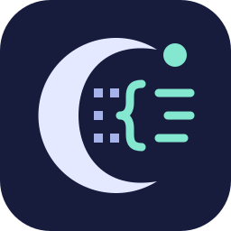

<p align="center">
  
</p>

<h1 align="center">unluac-rs</h1>

<p align="center"><a href="./README_cn.md">简体中文</a> | English</p>

<p align="center">
  <a href="https://crates.io/crates/unluac"></a>
  <a href="https://www.npmjs.com/package/unluac-js"></a>
  <a href="https://github.com/x3zvawq/unluac-rs/actions/workflows/release.yml"></a>
  <a href="https://github.com/x3zvawq/unluac-rs/actions/workflows/deploy-web.yml"></a>
  <a href="https://docs.rs/unluac"></a>
  <a href="./LICENSE.txt"></a>
</p>

<p align="center">
  <a href="https://unluac.x3zvawq.com">Open the Web App</a> ·
  <a href="https://github.com/x3zvawq/unluac-rs/releases">Download CLI</a> ·
  <a href="https://docs.rs/unluac">API Docs</a>
</p>

## Introduction

**Lua bytecode, made readable.** unluac-rs is a multi-dialect Lua decompiler written in Rust. It reconstructs readable source from compiled chunks, with a browser workspace for exploring the code and libraries for integrating decompilation into your own tools.

- **Lua 5.1–5.5, LuaJIT 2.1 and Luau** in one decompiler, with automatic bytecode dialect detection.
- **Source recovery built on program analysis:** control flow, bindings and value lifetimes inform the reconstruction of expressions, functions and structured statements.
- **A workspace for mixed versions:** open files or folders, keep a separate dialect per file, edit and export source, and inspect functions, constants and control-flow graphs.
- **Runs where you need it:** locally in your browser through WebAssembly, from the command line, or inside Rust and JavaScript applications. The web app processes files on your device without uploading them to a server.

## Usage

### Web

**[Open unluac.x3zvawq.com →](https://unluac.x3zvawq.com)**

Drop compiled files anywhere in the workspace, or open a file or folder. Bytecode is recognized by its contents, so no particular extension is required. Source files can also be opened for reading and editing.

Each file keeps its own Lua dialect. Click its version tag to change it; the dialect in Settings is only the default for new imports. Other decompilation settings apply to existing files automatically. File bytes and dialect choices are saved in the current browser; results are regenerated on reload, and manual edits should be downloaded before leaving.

Use the **Structure** panel to explore functions and constants, then select a function to inspect its control-flow graph. Collapse the panel when you want more room for the source.

If the hosted site is unavailable on your network, use the CLI below or [run the web app locally](./packages/unluac-web/README.md).

### CLI

Download a binary for your platform from [GitHub Releases](https://github.com/x3zvawq/unluac-rs/releases), or install from a local checkout:

```bash
cargo install --path packages/unluac-cli
```

Decompile a chunk with automatic dialect detection:

```bash
unluac-cli -i sample.luac -o recovered.lua
```

Choose a dialect explicitly, read from stdin, or compile a source file before decompiling it:

```bash
unluac-cli -i sample.luac -D lua5.4
cat sample.luac | unluac-cli -i -
unluac-cli -s example.lua -D lua5.4
```

Source input (`--source`) requires an explicit dialect and a compatible external compiler; release binaries do not bundle one. Set `--luac` to its path, or make it available on PATH. Source compilation strips debug metadata by default; use `--strip false` to retain it. `--ignore-debug` independently excludes available debug information from recovery for either input mode.

Use `--generate-mode strict` when you require target-compatible Lua output. The default permissive mode can return diagnostic pseudocode for constructs that cannot be represented. `--output` writes final source and cannot be combined with debug dumps, timing output or an earlier pipeline stage.

Choose fallback names with `--naming-mode` / `-n`. All modes prefer valid debug names; use `--ignore-debug` to disregard them.

| Mode | Names without debug information |
| --- | --- |
| `debug-like` (default) | Numbered names such as `p1_0` and `r1_0` for cross-referencing |
| `simple` | Generic `a`, `b`, `value`, plus basic loop/function roles |
| `heuristic` | Hints from expressions, field usage, module paths and call names, such as `arr`, `lvl`, `slot` and `user` |

For example: `unluac-cli -i sample.luac -n heuristic`. Heuristic names are readability hints, not recovered original names or runtime type guarantees. See [Naming](./docs/design/8.naming.md) for the mode boundaries.

Heuristic mode also uses a small standard-library signature table: arguments to `os.date` can suggest `format` and `time`, while `string.sub` suggests `text`, `start_index` and `end_index`. More specific field usage takes priority; conflicting roles keep generic names.

See `unluac-cli --help` for all formatting, naming and decoding options, and the [debugging guide](./docs/debug.md) for pipeline inspection.

### Rust

```bash
cargo add unluac
```

The library accepts bytes of a compiled chunk; default options detect the dialect and run through source generation.

```rust
use std::fs;
use unluac::decompile::{decompile, DecompileOptions};

fn main() -> Result<(), Box<dyn std::error::Error>> {
    let bytes = fs::read("sample.luac")?;
    let result = decompile(&bytes, DecompileOptions::default())?;

    if let Some(generated) = result.state.generated.as_ref() {
        println!("{}", generated.source);
    }
    Ok(())
}
```

See the [Rust API documentation](https://docs.rs/unluac) for options and pipeline results.

### JavaScript / TypeScript

```bash
npm install unluac-js
```

In Node.js, the package initializes its bundled WebAssembly module automatically:

```js
import { readFile } from "node:fs/promises";
import { decompile } from "unluac-js";

const bytes = await readFile("sample.luac");
const source = await decompile(bytes, { dialect: "auto" });
console.log(source);
```

The package also provides `detectDialect()`, `decompileRich()`, `init()` and `supportedOptionValues()`. See the [JavaScript guide](./packages/unluac-js/README.md) for browser bundling, explicit WASM initialization and Luau vector constructor options. Debug dumps and timing are available through the CLI and Rust library.

For custom bindings, start with [the WebAssembly package](./packages/unluac-wasm); JavaScript users should normally use `unluac-js`.

## Contributing and Feedback

The project is still in a testing phase. Behavior, APIs and output details may evolve. Bug reports, difficult bytecode samples, compatibility findings and suggestions about the tools or releases are very welcome.

If a file fails to decompile or the result behaves differently, please [open an issue](https://github.com/x3zvawq/unluac-rs/issues) with a reproducible sample, its Lua dialect, the options used, and the expected versus actual behavior. Include the original source when available. Real-world samples help improve both semantic correctness and output quality; decompilation cannot recover comments or information that compilation discarded.

Code, documentation and regression tests are all welcome. For development, start with the [architecture guide](./docs/design.md), [test protocol](./docs/design/11.test.md) and [web development guide](./packages/unluac-web/README.md).

## License

Released under the [MIT License](./LICENSE.txt).

## Acknowledgements

- [metaworms’s Lua decompiler](https://luadec.metaworm.site) and the author’s tutorial inspired the project’s design and implementation.
- Most of this project’s code was developed with **ChatGPT + Codex**. A special shout-out to **Astra** for its work on the decompiler and its extensive refactoring — seriously impressive. **Claude** also contributed during an earlier stage of development.
- Thanks to everyone sharing test cases, reporting bugs and helping make recovered Lua more readable.
